# Présences

Présences est un module de vie scolaire qui permet de **gérer tous les événements ayant lieu au sein de l'établissement scolaire**.

## Introduction

Le module Présence comprend plusieurs parties que nous détaillerons dans cette documentation :

* La gestions des **absences et des appels**
* La gestion des **présences**
* La gestion des **incidents et des punitions, sanctions**
* Le **publipostage** de tous ces événements

Le module Présences a l'avantage d'être **personnalisable** à différents niveaux et nous verrons dans une autre documentation comment paramétrer le module.

Par ailleurs certains écrans sont communs pour les CPE et enseignants, d'autres sont plus spécifiques. Nous préciserons par **\(VS\)** quand les pages ne concernent que les personnels de vie scolaire.

## Le tableau de bord

Le **tableau de bord** de Présences est la **porte d'entrée** de ce module et donne accès aux actions quotidiennes des différents acteurs de l'établissement. Sa **constitution dépend de votre profil** sur l'ENT. Ainsi, CPE, enseignants et parents n'y verront pas nécessairement les mêmes informations.

## Le tableau de bord des CPE

Ce tableau de bord se compose de :

* Un champ de recherche élève ou classe qui permet d'accéder à la **vue calendaire** de l'élève ou de la classe sélectionnée **\(1\)**
* Un champ de recherche classe qui permet d'accéder au **registre** de la classe pour le mois en cours **\(2\)**
* Un espace **d'alertes** qui permet de suivre les excès d'absences, retards, incidents et carnets oubliés **\(3\)**
* Un espace **Appels oubliés du jour** : qui se remplit des appels que les enseignants n'ont pas validé 15mn après le début de leur cours **\(4\)**
* Un espace **Déclaration des parents à traiter** : qui permet de gérer les déclarations d'absences réalisées en ligne par les parents **\(5\)**
* un panneau latéral qui donne directement **accès aux absences à régulariser** par les élèves. **\(6\)**

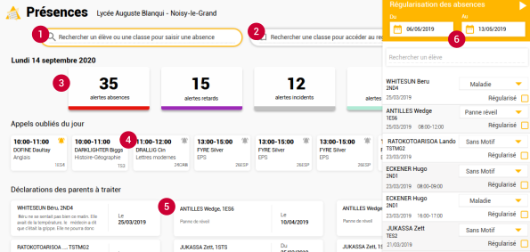

## Le tableau de bord des enseignants

Le tableau de bord Enseignants est plus directement tourné vers la saisie des appels et se compose :

* La **liste des appels** à effectuer dans la journée. Un clic sur une carte "appel" donne accès à la page complète de saisie d'un appel. **\(1\)** Un paramétrage permet de choisir la **génération d'un ou plusieurs appels pour des cours dépassant 1h**. Les appels multiples sont activés par défaut. Cela signifie que pour un cours de 2h, il y aura 2 appels à effectuer. L'activation ou la désactivation de ces appels multiples ne vaut que pour les cours à venir et n'est pas rétroactif. Le choix peut être modifié à tout moment.
* La **liste des présences** qu'il a déclaré dans la journée **\(2\)**
* Un panneau latéral qui lui donne un **accès direct à son appel du moment** **\(3\)**

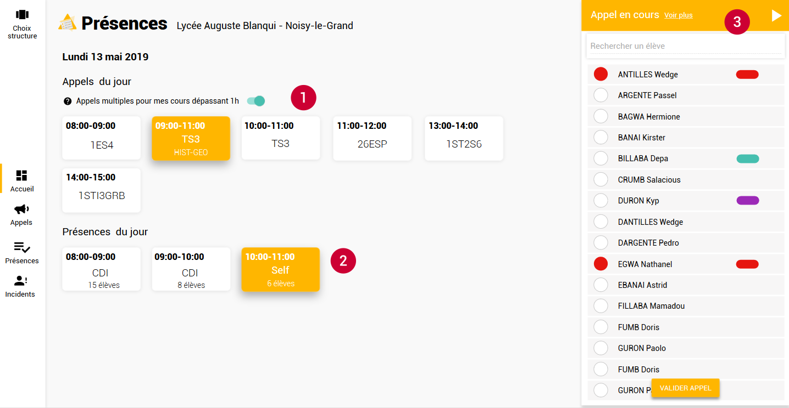

## Le tableau de bord des parents

Le tableau de bord des parents est centré sur les **événements liés à l'élève.**

Un **historique** occupe la place centrale avec un récapitulatif des différents événements de l'enfant \(absences, retards, départs anticipés, punitions et sanctions\). **\(1\)**

Un panneau latéral permet aux parents de **déclarer une absence en ligne** pour son enfant. **\(2\)**

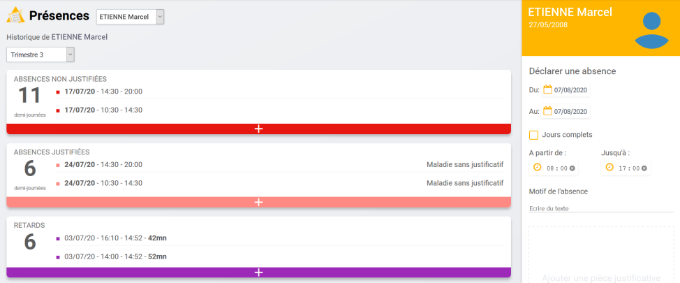

## La vue calendaire \(VS\)

La vue calendaire est le **coeur du module Présences** pour les personnels de vie scolaire. C'est à partir de cette vue qu'il est possible de **déclarer tous les événements** liés à un élève si on en a les droits.

_Y accéder_ : taper le nom de l'élève concerné directement **depuis le tableau de bord** dans le champ de recherche jaune et sélectionner-le dans la liste.

Automatiquement la vue calendaire s'ouvre sur l'élève et la semaine en cours.

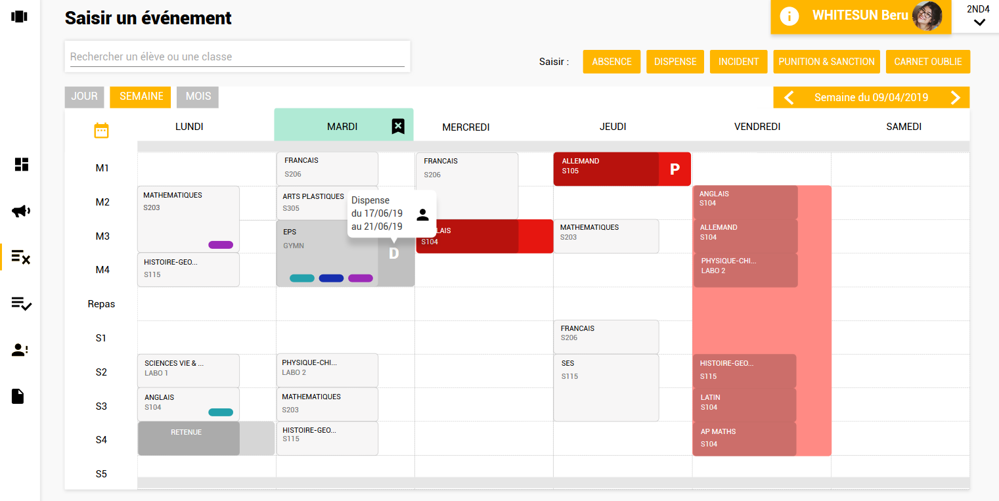

Depuis cette vue calendaire vous pouvez :

**Déclarer une absence**

* Soit à l'aide du bouton en haut à droite
* Soit en cliquant sur le créneau concerné ou en glissant sur les différents créneaux concernés

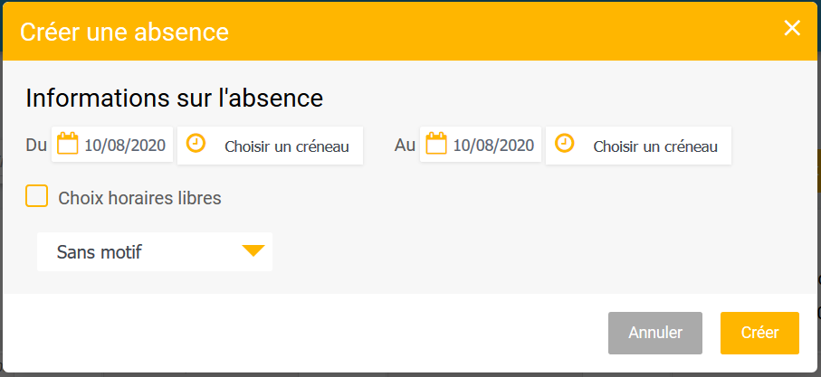

Renseigner les champs de **date**, **d'heure** et de **motif** puis cliquer sur Créer. La plage horaire sélectionnée se colore :

* en **rouge** si l'absence n'est pas justifiée \(sans motif\)
* en **rose** si elle est justifiée

 _Il est possible de paramétrer les motifs depuis les paramétrages._

**Déclarer une dispense, un incident, des punitions ou sanctions :** 

Nous verrons ces déclarations dans les pages concernées.

**Déclarer un carnet oublié :** 

Enfin, c'est ici que la vie scolaire peut déclarer qu'un élève a **oublié son carnet de correspondance.** Depuis le **bouton "Carnet oublié"** en haut à droite de l'écran. Une fenêtre s'ouvre qui vous permet de saisir la **date de l'oubli** et qui indique le **nombre d'oublis déjà recensés**. 

 _Le nombre maximal d'oublis de carnet toléré avant le déclenchement d'une alerte est paramétrable._

Ces événements Carnets oubliés seront consultables depuis le registre.

**Autres éléments de la vue calendaire**

Une fois sur la vue calendaire d'un élève, vous pourrez **facilement consulter la vue calendaire des autres élèves** de la classe. A côté du nom de l'élève, une bouton avec le nom de la classe et une flèche permet d'afficher la liste des élèves de la classe et de les sélectionner au fur et à mesure.

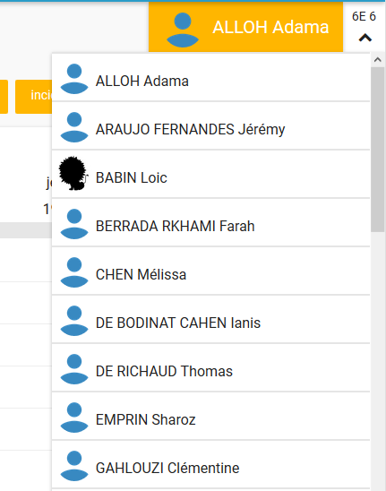

Vous pourrez aussi **aisément sélectionner une autre classe ou un autre élève** à partir du champ de recherche.

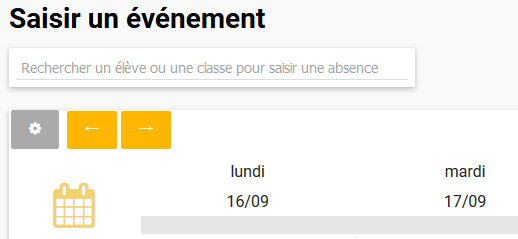

Enfin, cette vue calendaire vous permet de consulter tous les événements liés à un élève sur les créneaux de cours. Un code couleur + lettre vous permettra d'identifier :

* les **retards** \(violet\)
* les **départs anticipés** \(bleu-vert\)
* les **observations** \(bleu foncé\)
* les **dispenses** \(lettre D\)
* les **présences** \(lettre P\)
* les **carnets oubliés** \(vert d'eau sur l'intitulé du jour\)

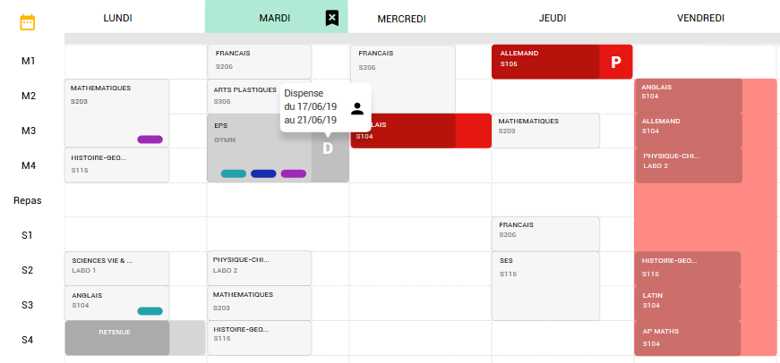

## Le registre \(VS\)

Le registre permet de **consulter tous les événements d'une classe sur un mois**. Il est accessible directement depuis la page d'accueil en rentrant le nom de la classe. 

Une fois le registre ouvert, il est possible de cliquer sur chaque événement pour en **avoir le détail**. Il est aussi possible de **filtrer l'affichage des événements** à l'aide des filtres situés sous la sélection du mois.

Enfin, chaque récapitulatif mensuel peut être **exporté au format csv** pour traiter les données dans un logiciel tableur.

 _Les périodes de fermeture sont paramétrables. Et par défaut, si aucun cours n'est positionné sur un jour sur l'année scolaire, ce jour est grisé dans le tableau. Cela permet d'afficher grisés les samedi et dimanche par exemple, s'il n'y a pas cours ces jours-là._

_Petite astuce_ : la **fiche élève de chaque élève est disponible en cliquant sur le nom de l'élève** dans tous les tableaux \(à l'exception de la liste des événements\).

## La liste des appels

Cette page recense :

* tous les appels de l'établissement pour les CPE
* ses propres appels pour les enseignants

Par défaut, le **filtre "appels oubliés" est sélectionné**. Ainsi apparaissent tous les appels qui **n'ont pas été validés par l'enseignant 15mn après le début du cours.**

Le CPE peut **notifier l'enseignant** pour lui rappeler qu'il doit valider son appel en cliquant sur la petite clochette dans la carte de l'appel. Cette notification arrive dans la messagerie ENT de l'enseignant concerné.

## La saisie d'un appel

L'appel est normalement saisi par l'enseignant mais peut l'être aussi par le CPE.

La page de saisie d'un appel comporte :

* les **différents créneaux** de cours de l'enseignant **\(1\)**
* la **liste des élèves** \(qui peut être rangée par ordre alphabétique ou par groupe dans le cas de cours avec plusieurs groupes d'enseignement\)**\(2\)** et **\(3\)**

Les différentes actions possibles :

* **Noter un élève absent** en cliquant sur le rond devant son nom : un tiret rouge apparaît pour indiquer l'absence. Dans l'historique à droite, le point correspondant au cours actuel se colore. **\(4\)**
* **Déclarer un retard ou un départ anticipé** : en cliquant sur le nom de l'élève, un panneau latéral s'ouvre qui permet de noter retard, départ et observations. En fonction de l'événement déclaré, un tiret de la couleur correspondante apparaît et le point se colore. Les retards sont en violet et les départs en vert. **\(5\)**

 

Des informations pour l'enseignant sont disponibles sur l'appel :

* **Si l'élève a été absent lors du dernier cours de l'enseignant**, un petit icône le lui signale 
* **Si l'élève a été noté absent par le CPE avant le début du cours**, l'absence est déjà déclarée et l'élève est grisé. S'il est finalement là, l'enseignant peut mettre une observation à destination de la vie scolaire.
* **Si l'élève a oublié son carnet de correspondance**, un petit icône le signale à l'enseignant.

Le CPE aussi peut saisir un appel depuis la liste des appels ou depuis son tableau de bord. A la différence de l'enseignant, il peut **directement saisir le motif** de l'absence depuis le panneau latéral.

Une fois l'appel effectué, il peut être **validé pour qu'il n'apparaisse plus dans la liste des appels oubliés** de la vie scolaire. Les événements, eux, sont créés dès leur saisie et modifié instantanément si l'enseignant modifie des données.

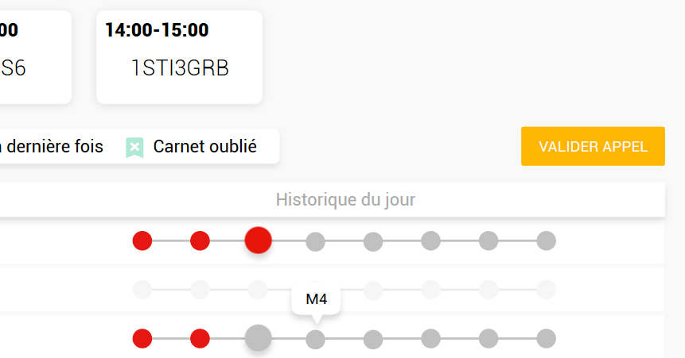

## La gestion des événements : absences, retards, dispenses \(VS\)

Cette gestion a été imaginée de façon **transversale**. Il est possible de réaliser des actions identiques à plusieurs endroits pour fluidifier la réalisation des tâches. Ces différents endroits sont reliés entre eux dans la mesure du possible.

## La liste des événements

Cette page centralise les **événements d'absence, retards, départs** de tout l'établissement et permet de les gérer. Il ne s'agit uniquement des événements ayant déjà eu lieu. Ainsi n'apparaissent pas les absences déclarées dans le futur depuis la vue calendaire.

Chaque ligne du tableau se compose ainsi :

* nom de l'élève et classe
* date de l'événement
* créneaux horaires concernés
* motifs
* documents \(éventuellement fournis par les parents\)
* actions en cours sur cet événement
* régularisation administrative

Le clic sur une ligne permet d'afficher le détail des événements par créneau et d'y apposer si besoin des motifs différents.

 Le clic sur l'icone à côté des périodes permet **d'accéder directement à la vue calendaire de l'élève** pour saisir un événement sur la journée ou sur une période plus longue.

Enfin, il est possible d'indiquer **les actions en cours concernant cet événement**. Cela permet à l'équipe de vie scolaire de suivre avec précision le traitement de l'événement même si ce n'est pas toujours la même personne qui s'en occupe. Au clic sur le + une fenêtre s'ouvre qui permet de saisir l'action en réalisée et un commentaire. Une fois validée, l'abréviation de l'action s'affiche dans le tableau.

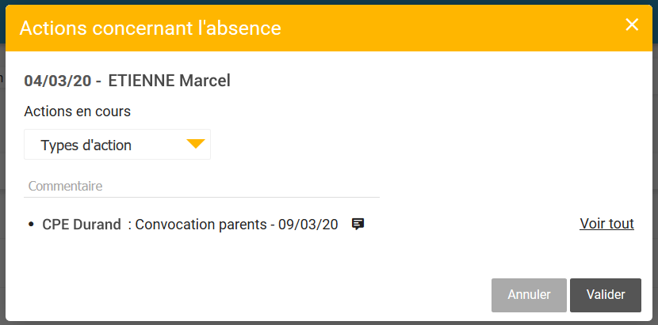

 _Les types d'actions et leurs abréviations sont paramétrables_.

Cette liste d'événement est bien entendu filtrable :

* par élève
* par classe
* par date
* par type d'événement
* par motif
* par état de l'absence : non justifiée, justifiée régularisée, justifiée non régularisée

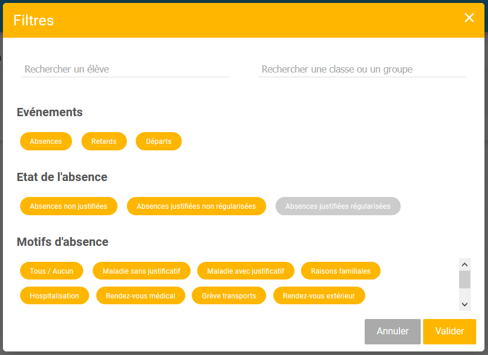

Pour information : **Absence non justifiée = absence sans motif** \(ne pas mettre de motif si celui qui est donné est considéré comme non recevable\).

## Événements : Les alertes \(VS\)

La page des alertes recense toutes les alertes déclarées sur l'établissement concernant les événements :

* **absences**
* **retards**
* **incidents**
* **carnets oubliés**

Depuis cette page, il est possible de déclarer une punition ou une sanction pour un ou plusieurs élèves. Il est aussi possible de réinitialiser les alertes pour repartir à 0. Pour cela, sélectionner une alerte en cliquant dessus puis choisir l'action à réaliser sur cette alerte.

Il est possible d'arriver sur cette page déjà filtrée en arrivant depuis le tableau de bord CPE en cliquant sur une des alertes.

 _Le maximum d'événements à atteindre pour déclencher une alerte est paramétrable_.

## Événements : Les déclarations en ligne \(VS\)

Il est possible grâce au module, **pour les parents, de déclarer en ligne une absence** pour leur enfant. Cela se fait depuis leur tableau de bord, sur la partie droite de leur écran \(voir Tableau de bord Parents\).

Ces déclarations une fois validées, apparaissent pour l'équipe de Vie scolaire à 2 endroits :

* sur le tableau de bord CPE \(voir Tableau de bord CPE\)
* sur la page Déclarations en ligne, derrière le menu "Evénements"

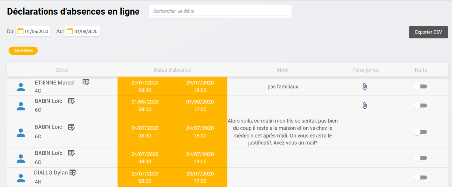

Vous pouvez accéder directement à la vue calendaire de l'élève pour créer l'absence en cliquant sur l'icône à côté de son nom : 

Vous pouvez également noter ces déclarations comme traitées. Cela les fait disparaître du tableau, pour lequel un filtre "non traités" est activé par défaut. Pour retrouver toutes les déclarations, désactivez ce filtre.

## Événements : Les dispenses \(VS\)

La page des dispenses est à la fois une page de **consultation et de saisie des dispenses**. Quand des dispenses ont été déclarées, la page met à disposition un tableau récapitulatif sur le mois en cours.

Le bouton **Saisir une dispense** \(également disponible depuis la vue calendaire de l'élève\) ouvre une fenêtre pour saisir le nom de l'élève, la période concernée, la discipline concernée, si la présence est obligatoire ou non, un commentaire :

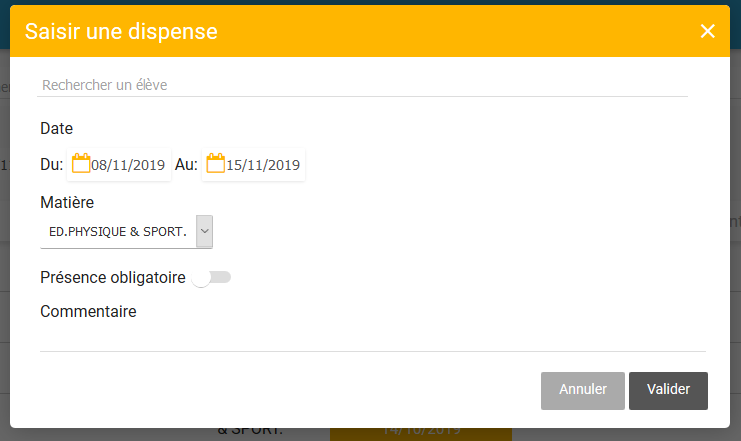

Il est aussi possible de **saisir des dispenses récurrentes** pour des élèves qui seraient dispensés sur l'année d'une ou plusieurs heures de cours \(orthophonie, kiné...\)

Depuis la fenêtre de saisie de dispenses, il est possible de choisir "dispense ponctuelle" ou "dispense récurrente".

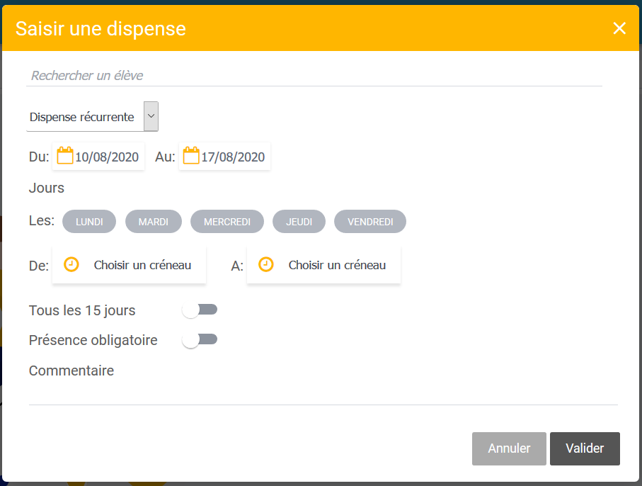

Cette fonctionnalité vous permet de **sélectionner des jours de la semaine ainsi que des créneaux**. Il est possible de déclarer ces dispenses récurrentes tous les 15 jours.

## La gestion des présences

Cette fonctionnalité est celle qui donne son nom au module. Elle permet de **déclarer la présence d'élèves sur des créneaux qui ne sont pas inscrits dans l'emploi du temps**.

Pour la Vie Scolaire, la page des Présences présente toutes les présences saisies dans l'établissement. Un filtre permet au CPE de ne voir que les présences qu'il a lui même remplies. En cliquant sur une carte, une pop-up s'ouvre qui permet au CPE d'avoir toutes les informations nécessaires sur cette présence. Des **champs de recherche "personnel" ou "élève"** permettent de retrouver des déclarations de présences spécifique.

Pour les enseignants, la page des Présences présente toutes les présences qu'il a saisies.

Pour saisir une présence, cliquer sur le bouton **Saisir une présence** en haut à droite. Il suffit ensuite de **remplir les différents champs et de sélectionner les élèves et/ou les classes à ajouter**. Il est possible d'ajouter une classe et ensuite d'en retirer certains élèves à l'aide de la croix en fin de ligne.

Il est possible de **rédiger un bref commentaire** sur la présence de l'élève qui ne sera visible que depuis cette fenêtre.

Enfin, si une présence est déclarée alors que l'élève est par ailleurs noté absent sur un créneau de l'emploi du temps, **la lettre P sera visible sur la vue calendaire afin d'avertir la vie scolaire d'un éventuel conflit**. Si aucun créneau de cours n'est concomitant avec cette présence, l'information se trouvera uniquement sur la page des présences.

 _Les lieux et moments pour lesquels il est possible de déclarer une présence sont paramértables_.

## La gestion des incidents

La gestion des incidents est liée à celle des punitions, sanctions et comme pour les absences peut se faire de différents endroits dans le module.

La page des incidents est à la fois une page de **consultation et de saisie des incidents**. Quand des incidents ont été déclarés, la page met à disposition un tableau récapitulatif sur le mois en cours. 

En cliquant sur une ligne il est possible d'en afficher les détails. 

Le bouton **Saisir un incident** \(également disponible depuis la vue calendaire de l'élève\) ouvre une fenêtre pour saisir le contexte et les caractéristiques de l'incident ainsi que les protagonistes :

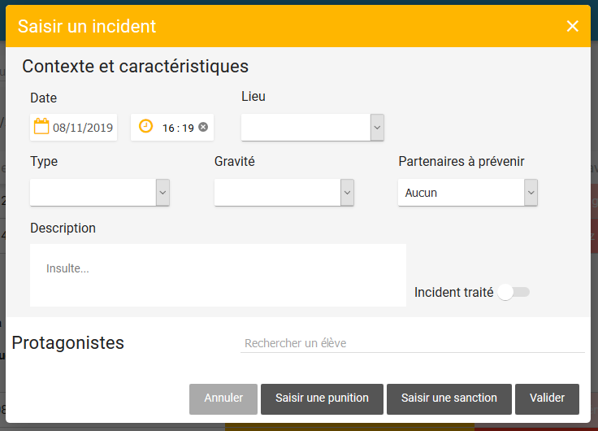

Une fois les champs remplis, il est possible de **valider** et donc de fermer la fenêtre et de retourner au tableau récapitulatif.

 _Tous les champs de la fenêtre d'incident seront paramétrables._

## La gestion des Punitions et sanctions :

Cette fonctionnalité permet de déclarer des punitions ou des sanctions à l'encontre d'un ou plusieurs élèves.

Accessible depuis l'entrée de menu **Incidents**, cette page donne accès au tableau des punitions et sanctions déjà données et vous permet d'en créer une nouvelle à l'aide du bouton en haut à droite.

Après avoir cliqué sur le bouton **"Saisir une punition/sanction"**, une fenêtre s'ouvre avec plusieurs champs à remplir.

* Vous pouvez chercher **un ou plusieurs élèves**
* Sélectionner un type : attention **le droit de mettre des sanctions est réservé au profil Direction**
* En fonction du type choisis, de nouveaux champs vont apparaître pour entrer des dates, des heures etc...

  

* Vous pouvez entrer une description si vous ne souhaitez pas déclarer d'incident.

Une fois cette fenêtre validée, la ligne correspondant à la punition saisie apparaît dans le tableau. Si vous avez déclaré une punition pour plusieurs élèves, il y aura plusieurs lignes.

 _Les types de punitions et sanctions sont paramétrables._

## Le publipostage

Le publipostage permet de traiter en masse l'envoi de courrier aux familles concernant différents événements.

Ce publipostage peut être fait :

* **par mail**
* **par sms**
* **par génération de pdf** \(en cours de développement\)

Il peut concerner les absences justifiées ou non, les retards, \(les punitions et les sanctions en cours de développement\). Si absences et retards peuvent faire l'objet d'un même publipostage, les punitions et sanctions doivent être traitées à part.

Des **filtres** vous sont proposés pour affiner votre publipostage. 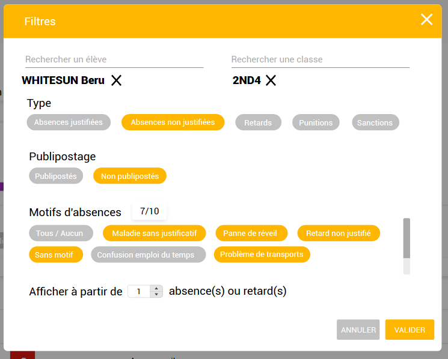

Une fois **les filtres sélectionnés \(1\)** vous disposez d'un **récapitulatif du nombre d'événements à publiposter \(2\)**. Si des **anomalies** existent au niveau des coordonnées des parents, elles seront directement visibles dans un **tableau sous le récapitulatif \(3\)**. Enfin vous pourrez sélectionner **le mode de publipostage à l'aide des boutons en haut à droite \(4\)**.

 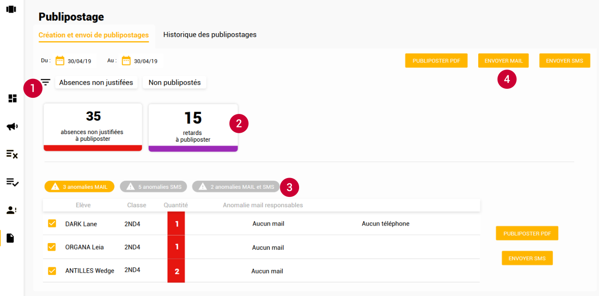

En cliquant sur le mode de publipostage, une pop-up s'ouvre avec :

* **le récapitulatif de ce qui est envoyé**
* **le message à envoyer** : vous aurez le choix du message parmi ceux que vous aurez paramétrés.
* **la liste des personnes à qui ce message va être envoyé** : c'est là que vous pouvez déselectionner certaines personnes.

  

Une fois le publipostage effectué, il est possible d'en **consulter l'historique** depuis un 2ème onglet. Cet historique présente tous les envois qui ont été réalisés sur la période que vous souhaitez. Il est ainsi possible de consulter tous les publipostages pour un élève, pour certains types d'événements.

