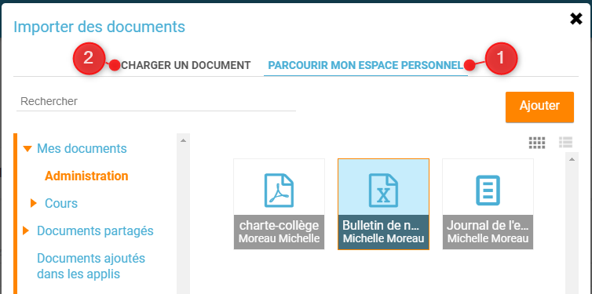
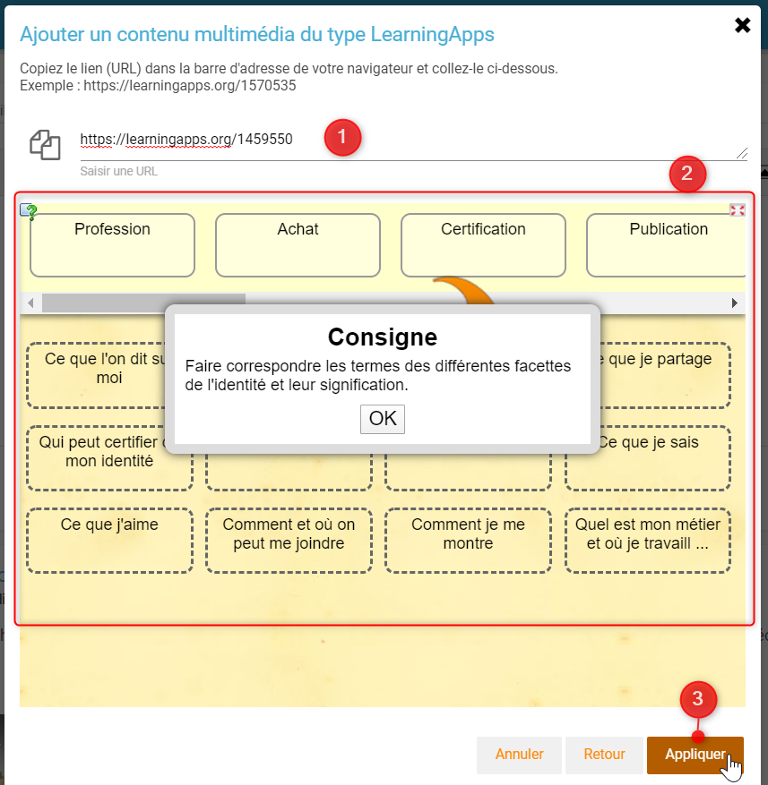

# Premiers pas

## La page d’accueil

La page d’accueil est la première page affichée après vous être connecté sur la plateforme. Elle vous permet d’accéder à différentes fonctions et contenus, comme le fil de nouveautés, les widgets, le bandeau de navigation \(présents sur chaque page de l’ENT\) mais aussi de changer de thème.

## Le fil de nouveautés

Le fil de nouveautés affiche les dernières informations et contenus qui vous concernent.

Il est composé des éléments suivants :

* Le menu dépliant en haut de la page qui permet de paramétrer l’affichage des notifications par service ;
* Le lien vers le profil de la personne qui vous a partagé l’information ou le contenu ;
* Le lien vers l’information ou le contenu.
* Une indication sur l’application concernée par la notification

Pour filtrer les notifications reçues, déplier le menu "Filtrer les nouveautés" et cliquez sur les applications dont vous souhaitez visualiser les notifications ou non.

Pour accéder à une information ou un contenu qui vous a été partagé, cliquez sur le lien présent dans la nouveauté.

Le contenu s’affiche.

Pour accéder au profil de l’utilisateur qui vous a partagé le contenu ou l’information, cliquez sur son identifiant.

Le profil de l’utilisateur s’affiche.

## Suppression et signalement des notifications

Sur le fil de nouveauté, vous avez la possibilité de ne plus voir la notification reçue et/ou de signaler à l’administrateur de votre établissement une notification inappropriée. Une flèche d’action s’affiche sur la notification lors du survol de celle-ci.

Lorsque vous cliquez sur la flèche, les actions concernant la notification sélectionnée s’affichent.  
Vous pouvez :

* Supprimer l’affichage de la notification de votre fil de nouveauté
* Signaler la notification comme inappropriée à votre référent ENT

Vous avez également la possibilité de ne pas diffuser une notification aux utilisateurs avec lesquels vous avez des droits de communication ou vous avez partagé du contenu. Depuis votre espace "Mon compte", vous retrouverez toutes les notifications que vous avez émises en cliquant sur l’onglet "Historique"

Comme précédemment, en survolant la notification avec la souris, vous verrez apparaître une flèche sur la droite de la notification. En cliquant sur cette flèche, une action apparaît vous permettant de supprimer définitivement la notification.

## Les widgets

Les widgets se situent à gauche du fil de nouveautés. Ils sont composés des notes personnelles, du calendrier, des actualités, du flux RSS, du dictaphone et des signets.

* Le widget **Notes** \(pense-bêtes\) permet à l’utilisateur de saisir des notes personnelles conservées à chaque déconnexion/reconnexion

* Le widget **Calendrier** affiche le mois en cours et la date du jour

* Le widget **Actualités** affiche les 5 dernières actualités publiées dans votre réseau

* Le widget **Flux RSS** permet d’afficher un flux d’informations issues d’un site externe. L’utilisateur peut récupérer l’adresse du flux de 3 sites externes maximum.

* Le widget **Signets** permet de créer des liens redirigeant vers une adresse internet choisie dans un nouvel onglet. L’utilisateur saisit le nom du lien qui sera affiché, renseigne son adresse web et clique sur « Enregistrer ».

* Le widget **Dictaphone** permet d’enregistrer des sons depuis le micro de son ordinateur. Les sons seront enregistrés dans l’espace documentaire de l’utilisateur.

* Le widget **Applications préférées** permet d’afficher les applications favorites directement depuis la page d’accueil.

Vous pouvez changer l’ordre d’apparition des widgets sur la page d’accueil en sélectionnant le widget puis en le déplaçant sur la page.

## Le bandeau de navigation

Le bandeau de navigation situé en haut de la page permet d’accéder à différents services, quelle que soit l’appli dans laquelle vous naviguez.

Les différents services disponibles sont les suivants :

* L’accès à votre compte 
* Le bouton de retour à la page d’accueil  
* Le bouton d’accès aux applis  
* Le bouton d’accès à l’appli Communautés 
* Le bouton de recherche sur l’ENT 
* Le bouton de notification de nouveaux messages reçus et d’accès à la messagerie 
* Le bouton de déconnexion du portail 

## L’éditeur de texte

L’éditeur de texte permet de rédiger des contenus et de les mettre en forme : type de police, taille de l'écriture, couleur de texte, etc.

L’éditeur permet également d’intégrer différents types de contenus :

1. Une image
2. Un fichier audio
3. Une vidéo
4. Une formule Latex
5. Un lien

L'éditeur permet désormais d’ajouter plus simplement des pièces jointes dans un contenu.

Lorsque l’on clique sur l’icône d’ajout de pièces jointes, on peut choisir un document de sa bibliothèque multimédia \(1\) ou charger un document depuis son poste \(2\).

La ou les pièces jointes sélectionnées apparaissent dans la zone d'édition dans un cadre dédié.

Pour modifier les pièces jointes, faire un clic droit dans la zone grisée et cliquer sur "Modifier les fichiers" \(3\).

## L'éditeur d’images

L’éditeur d’images permet de modifier une image en cours d’import ou déjà importée. Vous pouvez y accéder directement en cliquant sur une image depuis l'éditeur :

Depuis la fenêtre d’import d’images :

Ou encore depuis l’espace documentaire :

L’éditeur d’images permet de :

1. Pivoter une image
2. Rogner
3. Flouter des visages ou une partie de l'image
4. Redimensionner
5. Changer le titre, ajouter un texte alternatif pour les mal-voyants ou une légende

## Intégrer un contenu multimédia

Dans les différentes applications \(blog, actualités, messagerie, cahier de textes, wiki …\), vous pouvez intégrer des contenus multimédia comme des exercices interactifs, des vidéos, des murs collaboratifs, etc. Pour cela, rendez-vous sur une application, cliquez sur le bouton “Créer” et accédez à l’éditeur de texte. Cliquez sur l’icône multimédia présente dans la barre d’édition.

**Intégrer un lien :**

 Différentes ressources sont proposées par défaut \(LearningApps, Educaplay, YouTube, Dailymotion, Vimeo, Libcast...\) et peuvent être intégrées à un service en recopiant leur adresse internet \(ex : [https://learningapps.org/1459550](https://learningapps.org/1459550)\).

a\) Copiez d’abord l’adresse URL du contenu

b\) Intégrez la ressource dans une application

 Cliquez sur l’icône du type de contenu à insérer, \(LearningApps dans notre exemple\).

Une nouvelle fenêtre s’ouvre, dans laquelle vous pouvez coller l’adresse de la ressource en question \(1\). Une prévisualisation du contenu s’affiche \(2\), si vous souhaitez l’intégrer, cliquez sur le bouton “Appliquer” \(3\).

La ressource est maintenant intégrée à votre contenu !

## La gestion des paramètres

La gestion des paramètres vous permet de modifier votre thème d’apparence mais également de choisir l’affichage de ses widgets.

Pour y accéder, cliquez sur le bouton à droite de votre fil de nouveautés.

L’onglet de gestion de vos paramètres apparaît.

Pour changer l’apparence de votre thème, cliquez sur celui de votre choix.

L’apparence de votre thème est modifiée.

Pour décider d’afficher seulement certains widgets, désélectionnez ceux que vous ne souhaitez pas voir apparaître sur votre page d’accueil. Ils seront grisés dans la gestion de vos paramètres.

## Notifications externes

Votre réseau est doté d’un système de notification par mail qui permet aux utilisateurs de recevoir sur leur adresse personnelle des mails contenant les dernières nouveautés et informations qui les concernent.  
Chaque utilisateur peut modifier les notifications qu’il souhaite recevoir et la fréquence de chacune d’elles \(immédiate, quotidienne, hebdomadaire\).  
Pour accéder à ce paramétrage, aller dans Mon compte \(1\) et cliquer sur le bouton "Gérer mes notifications externes" \(2\).

La page de paramétrage des notifications externes permet de modifier l’adresse de réception des mails \(3\) et de choisir la fréquence d’envoi de chaque notification \(immédiat, quotidien, hebdomadaire, jamais\) \(4\).  
Le détail des notifications disponibles par service est accessible en cliquant sur le nom du service dans la ligne correspondante \(5\).

Lorsque les modifications sont terminées, cliquer sur "Enregistrer" en bas du tableau \(6\).

Une fois la notification reçue dans sa boîte mail personnelle, l’utilisateur peut cliquer sur le lien correspondant afin d’accéder au contenu. S’il n’est pas connecté, il devra saisir son identifiant et son mot de passe pour accéder à l’objet de la notification.

## Le moteur de recherche

Le service Moteur de recherche a pour objectif de permettre à chaque utilisateur identifié d’effectuer une recherche par mots-clés parmi les ressources de certaines catégories qui lui sont accessibles.

Les ressources sont recherchées dans les catégories suivantes :

* Aide et support
* Réservation de ressources
* Espace documentaire
* Agenda
* Mur collaboratif
* Wiki
* Frise chronologique
* Pad
* Actualité
* Carte mentale
* Forum
* Poste-Fichiers
* Sondage


Seules les ressources pour lesquelles l’utilisateur a un droit d’accès sont affichées dans le moteur de recherche.


Vous pouvez accéder à la page de recherche en cliquant sur l’icône de recherche \(1\) de la barre du menu principale. Saisissez les mots-clés dans la zone de saisie \(2\) et validez votre recherche en appuyant sur la touche « Entrée » ou en cliquant sur le bouton « GO ».

## Message Flash

Des messages d’informations à destinations de tous les utilisateurs de l’ENT s’affichent dans le fil de nouveautés via un bandeau coloré \(1\).

Après avoir pris connaissance du message, vous avez la possibilité de le supprimer en cliquant sur la croix à droite de celui-ci \(2\).

## Partage et favoris de partage

Vous retrouvez la fenêtre de partage dans la majeure partie des applications. Cette fenêtre vous permet de partager un contenu que vous avez crée ou sur lequel vous avez des droits de gestion. Le bouton "Partager" est accessible en règle générale dans le menu qui apparaît en bas de votre écran. Sélectionnez le contenu en question \(1\) puis cliquez sur "Partager" \(2\).

Vous accédez à la fenêtre de partage dans laquelle vous allez pouvoir rechercher des utilisateurs. Renseignez les premières lettres de la personne, ou du groupe que vous recherchez \(1\). Dans la liste qui vous est proposée, sélectionnez le ou les utilisateurs recherchés \(2\). Si l’utilisateur ou le groupe n’apparaît pas, cliquez sur "Voir la suite" pour dérouler la liste de propositions \(3\).

Vous avez la possibilité d’enregistrer une liste d’utilisateurs ou de groupes comme favori de partage. Une fois vos destinataires sélectionnés, cliquez sur "Enregistrer comme favori de partage" \(1\).

Il vous suffit ensuite d’inscrire le nom que vous souhaitez donner au favori \(1\) et cliquer sur OK \(2\).

Vous retrouverez ensuite ce favori de partage dans votre barre de recherche, au nom que vous avez enregistré. Vous pourrez ainsi partager plus facilement à un groupe de destinataires avec lequel vous avez l’habitude d'échanger régulièrement des contenus. Après avoir sélectionné votre favori de partage, il vous sera toujours possible de consulter la liste des membres du favori directement dans la fenêtre de partage. Cliquez sur la petite encoche à côté du nom de votre favori \(1\). Consultez les personnes ou les groupes rattachés à votre liste \(2\).


Afin que votre partage soit pris en compte, n’oubliez pas de cliquer sur le bouton "Partager".


